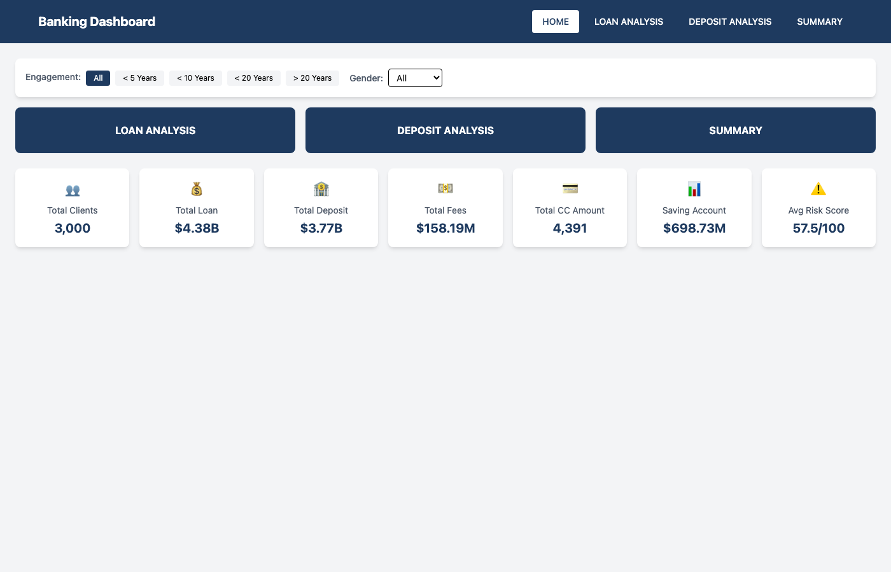
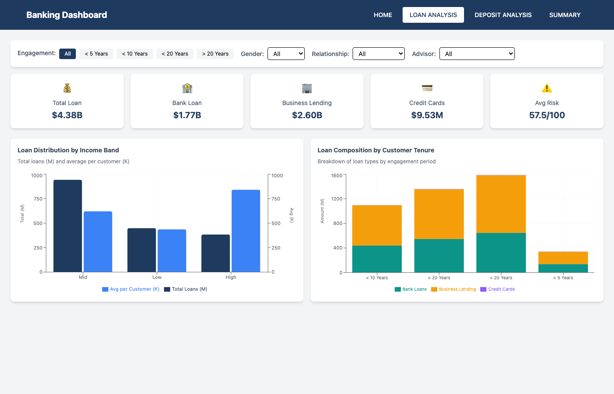
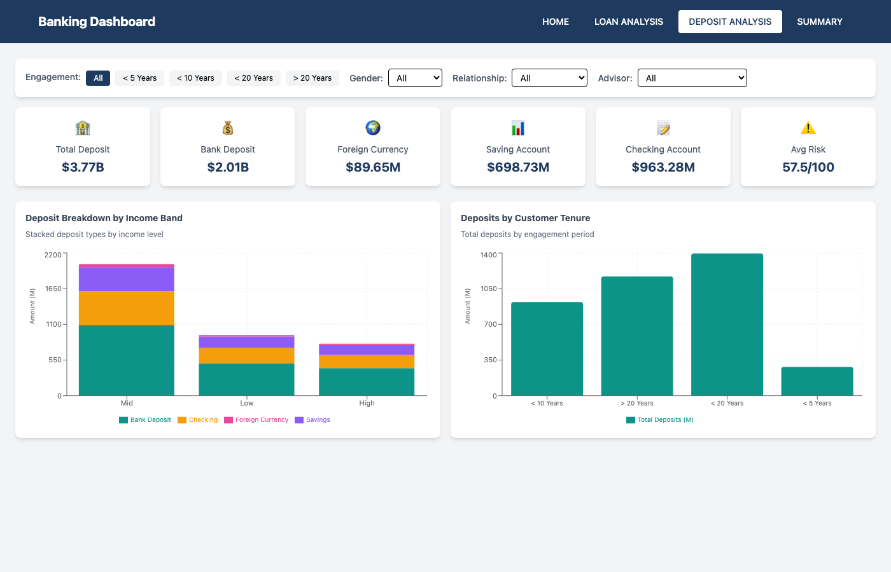

# Demo ETL Risk Analysis Dashboard

A comprehensive banking risk assessment platform featuring a Python ETL pipeline and React/TypeScript interactive dashboard for analyzing customer loan portfolios, deposit distributions, and custom risk scoring.

## Table of Contents

- [Overview](#overview)
- [Architecture](#architecture)
- [Risk Scoring Algorithm](#risk-scoring-algorithm)
- [Dashboard Pages](#dashboard-pages)
  - [Home Dashboard](#home-dashboard)
  - [Loan Analysis](#loan-analysis)
  - [Deposit Analysis](#deposit-analysis)
  - [Summary Dashboard](#summary-dashboard)
- [KPI Definitions](#kpi-definitions)
- [Installation](#installation)
- [Usage](#usage)
- [Tech Stack](#tech-stack)

---

## Overview

This project provides end-to-end risk analysis for a banking institution with 3,000 customers. It includes:

- **ETL Pipeline**: Python-based data extraction, transformation, and loading
- **Custom Risk Scoring**: 5-component algorithm generating 0-100 risk scores
- **Interactive Dashboard**: Real-time filtering and visualization of KPIs
- **Multi-dimensional Analysis**: Breakdown by income band, customer tenure, gender, relationship type, and advisor

---

## Architecture

```
leaderbank-risk-project/
├── Banking.csv                 # Source data (3,000 customer records)
├── main.py                     # ETL pipeline entry point
├── calculate_risk_scores.py    # Risk score calculation script
├── src/
│   ├── extract.py              # Data loading and validation
│   ├── transform.py            # Data cleaning and feature engineering
│   ├── kpis.py                 # KPI calculation functions
│   ├── load.py                 # Export to CSV
│   └── risk_scoring.py         # Custom risk scoring algorithm
├── output/                     # Generated CSV files
│   ├── cleaned_banking.csv
│   ├── kpi_summary.csv
│   ├── kpi_by_*.csv
│   └── risk_score_breakdown.csv
└── dashboard/                  # React/TypeScript frontend
    ├── src/
    │   ├── pages/              # Dashboard views
    │   ├── components/         # Reusable UI components
    │   └── utils/              # Data loading utilities
    └── public/                 # Static assets and data
```

---

## Risk Scoring Algorithm

The custom risk scoring system replaces the original 1-5 scale with a granular 0-100 score based on five weighted components:

### Components

| Component | Weight | Formula | Risk Logic |
|-----------|--------|---------|------------|
| **Debt Burden** | 35% | `(Bank Loans + CC Balance + Business Lending) / Income` | Higher debt-to-income = Higher risk |
| **Liquidity Risk** | 25% | `Liquid Assets / Total Debt` | Less coverage = Higher risk |
| **Credit Utilization** | 20% | `Credit Card Balance / Income` | Higher utilization = Higher risk |
| **Asset Backing** | 10% | `(Properties + Superannuation) / Total Debt` | Less collateral = Higher risk |
| **Tenure Risk** | 10% | `Years with Bank (normalized)` | Newer customers = Higher risk |

### Risk Categories

| Score Range | Category | Description |
|-------------|----------|-------------|
| 0-30 | **Low** | Minimal risk exposure |
| 31-60 | **Moderate** | Standard risk profile |
| 61-80 | **High** | Elevated risk requiring attention |
| 81-100 | **Critical** | Immediate risk mitigation needed |

### Current Portfolio Distribution

- **Mean Risk Score**: 57.5/100
- **Low Risk**: 99 customers (3.3%)
- **Moderate Risk**: 1,339 customers (44.6%)
- **High Risk**: 1,562 customers (52.1%)
- **Critical Risk**: 0 customers (0%)

---

## Dashboard Pages

### Home Dashboard



The landing page provides a high-level overview of the entire portfolio with key metrics and navigation to detailed analysis pages.

#### KPIs Displayed

| KPI | Current Value | Description |
|-----|---------------|-------------|
| **Total Clients** | 3,000 | Total number of customers in the portfolio |
| **Total Loan** | $4.38B | Sum of all loan products (bank loans + business lending + credit cards) |
| **Total Deposit** | $3.77B | Sum of all deposit accounts |
| **Total Fees** | $158.19M | Revenue from processing fees |
| **Total CC Amount** | 4,391 | Number of credit cards issued |
| **Saving Account** | $698.73M | Total in savings accounts |
| **Avg Risk Score** | 57.5/100 | Portfolio-wide average risk score |

#### Filters Available

- **Engagement Period**: All, <5 Years, <10 Years, <20 Years, >20 Years
- **Gender**: All, Male, Female

---

### Loan Analysis



Deep-dive into the loan portfolio with breakdowns by income band and customer tenure.

#### KPIs Displayed

| KPI | Current Value | Description |
|-----|---------------|-------------|
| **Total Loan** | $4.38B | Combined value of all loan products |
| **Bank Loan** | $1.77B | Traditional bank loans |
| **Business Lending** | $2.60B | Commercial and business loans |
| **Credit Cards** | $9.53M | Outstanding credit card balances |
| **Avg Risk** | 57.5/100 | Average risk score for filtered customers |

#### Charts

**1. Loan Distribution by Income Band**
- Dual-axis chart showing total loans (M) and average per customer (K)
- Segments: Low, Medium, High income bands
- Insight: Higher income customers have larger absolute loans but similar averages

**2. Loan Composition by Customer Tenure**
- Stacked bar chart breaking down loan types
- Color coding:
  - Teal: Bank Loans
  - Amber: Business Lending
  - Purple: Credit Cards
- Insight: Longer-tenured customers (>20 years) have the highest loan exposure

#### Additional Filters

- **Relationship Type**: Retail, Institutional, Private Bank, Commercial
- **Investment Advisor**: 22 advisors available for filtering

---

### Deposit Analysis



Comprehensive view of deposit products and customer savings behavior.

#### KPIs Displayed

| KPI | Current Value | Description |
|-----|---------------|-------------|
| **Total Deposit** | $3.77B | Sum of all deposit products |
| **Bank Deposit** | $2.01B | Standard bank deposits |
| **Foreign Currency** | $89.65M | Foreign currency accounts |
| **Saving Account** | $698.73M | Dedicated savings accounts |
| **Checking Account** | $963.28M | Checking/transaction accounts |
| **Avg Risk** | 57.5/100 | Average risk score for filtered customers |

#### Charts

**1. Deposit Breakdown by Income Band**
- Stacked bar chart showing deposit composition
- Color coding:
  - Teal: Bank Deposit
  - Amber: Checking
  - Purple: Savings
  - Pink: Foreign Currency
- Insight: Medium income customers hold the most deposits overall

**2. Deposits by Customer Tenure**
- Bar chart showing total deposits by engagement period
- Insight: Customers with 10-20 years tenure have accumulated the most deposits

---

### Summary Dashboard


Complete KPI overview displaying all 13 key performance indicators in a single view.

#### All KPIs

| Category | KPI | Value | Description |
|----------|-----|-------|-------------|
| **Customer** | Total Clients | 3,000 | Portfolio size |
| **Loans** | Total Loan | $4.38B | All loan products |
| | Bank Loan | $1.77B | Traditional loans |
| | Business Lending | $2.60B | Commercial loans |
| | Credit Cards Balance | $9.53M | CC outstanding |
| **Deposits** | Total Deposit | $3.77B | All deposit products |
| | Bank Deposit | $2.01B | Standard deposits |
| | Checking Account | $963.28M | Transaction accounts |
| | Saving Account | $698.73M | Savings accounts |
| | Foreign Currency | $89.65M | FX accounts |
| **Other** | Total CC Amount | 4,391 | Cards issued |
| | Total Fees | $158.19M | Fee revenue |
| **Risk** | Average Risk Score | 57.5/100 | Portfolio risk |

---

## KPI Definitions

### Loan Metrics

- **Total Loan**: `Bank Loans + Business Lending + Credit Card Balance`
- **Bank Loan**: Traditional personal and mortgage loans
- **Business Lending**: Commercial loans, lines of credit, equipment financing
- **Credit Cards Balance**: Outstanding revolving credit

### Deposit Metrics

- **Total Deposit**: `Bank Deposits + Checking + Savings + Foreign Currency`
- **Bank Deposit**: Term deposits, CDs, fixed deposits
- **Checking Account**: Transaction/current accounts
- **Saving Account**: Interest-bearing savings accounts
- **Foreign Currency**: Multi-currency accounts

### Risk Metrics

- **Average Risk Score**: Mean of individual customer risk scores (0-100)
- **Risk Weighting**: Per-customer composite risk score

### Revenue Metrics

- **Total Fees**: Processing fees calculated as `0.025 * Total Loan + 0.015 * Total Deposit`

---

## Installation

### Prerequisites

- Python 3.8+
- Node.js 16+
- npm or yarn

### Backend Setup

```bash
# Clone repository
git clone https://github.com/aaryouz/LeaderBank-Risk-Analysis.git
cd LeaderBank-Risk-Analysis

# Install Python dependencies
pip install -r requirements.txt

# Run ETL pipeline
python3 main.py

# Calculate risk scores
python3 calculate_risk_scores.py
```

### Frontend Setup

```bash
# Navigate to dashboard
cd dashboard

# Install dependencies
npm install

# Start development server
npm run dev
```

The dashboard will be available at `http://localhost:5173`

---

## Usage

### Running the ETL Pipeline

```bash
python3 main.py
```

This will:
1. Load and validate `Banking.csv`
2. Clean data and engineer features
3. Calculate all KPIs
4. Export results to `output/` directory

### Updating Risk Scores

```bash
python3 calculate_risk_scores.py
```

This will:
1. Calculate 5-component risk scores for all customers
2. Update `Banking.csv` with new scores
3. Generate `output/risk_score_breakdown.csv` with component details

### Refreshing Dashboard Data

After running the ETL pipeline, copy the output to the dashboard:

```bash
cp output/cleaned_banking.csv dashboard/public/
```

---

## Tech Stack

### Backend
- **Python 3.x** - ETL and risk calculation
- **Pandas** - Data manipulation
- **NumPy** - Numerical operations

### Frontend
- **React 18** - UI framework
- **TypeScript** - Type safety
- **Vite** - Build tool
- **Tailwind CSS** - Styling
- **Recharts** - Data visualization
- **React Router** - Navigation
- **PapaParse** - CSV parsing

---

## Data Sources

The project uses synthetic banking data representing:
- 3,000 customer records
- 24 original attributes including demographics, account balances, and risk factors
- Derived fields for engagement analysis and fee calculations

---

## Future Enhancements

- [ ] Add customer-level drill-down views
- [ ] Implement predictive risk modeling (ML)
- [ ] Add time-series trend analysis
- [ ] Export functionality for reports
- [ ] Real-time data integration
- [ ] Alert system for high-risk customers

---

## License

MIT License

---

## Author

Built with Claude Code assistance.

Repository: https://github.com/aaryouz/LeaderBank-Risk-Analysis
